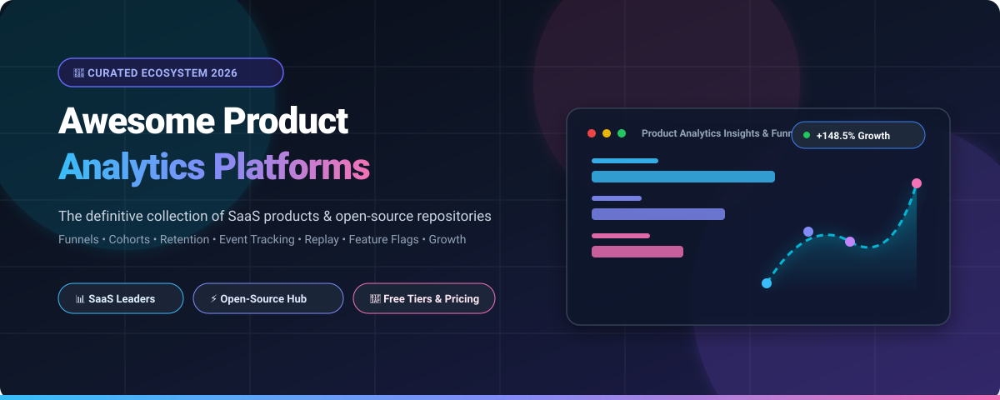

# 🚀 Awesome-Product-Analytics-Platform

  

  
  
  
  
  
  
  
  

---

## 🌟 Top Product Analytics Platform Ecosystem

> 🎯 **A Comprehensive, SEO-Optimized & Curated List of SaaS Products & Open-Source GitHub Projects**  
> *Focused on Event Tracking, Funnel Conversion, Cohort Retention, User Behavior Intelligence, Session Replays, Feature Flags, A/B Testing & Product Growth Analytics.*  
> 📅 **Last updated: September 2026**

This repository is the definitive directory tracking top-tier **SaaS platforms** and **open-source projects** for **Product Analytics**, **Digital Experience Analytics (DXA)**, and **Product-Led Growth (PLG)**. These tools empower product managers, data teams, growth marketers, and software engineers to decode user interactions, map customer journeys, optimize onboarding drop-offs, and run high-velocity experiments.

---

## 📑 Table of Contents
- [📊 Market Overview & SaaS/Hosted Platforms](#-saashosted-platforms)
- [⚡ Open-Source GitHub Projects (Ranked by Stars)](#-open-source-github-projects)
- [🧩 Specialized Architecture & Complementary Tools](#-specialized-architecture--complementary-tools)
- [💡 How to Choose the Right Platform](#-how-to-choose-the-right-platform)
- [📈 Star History](#-star-history)
- [🤝 How to Contribute](#-how-to-contribute)
- [⚖️ Disclaimer & Privacy Compliance](#-disclaimer--privacy-compliance)

---

## 📊 SaaS/Hosted Platforms

> 🌐 **Market Size & Industry Dynamics**: The global product analytics market is estimated at **$16.8 Billion in 2025** and is projected to reach **$41.2 Billion by 2030** (growing at a rapid CAGR of ~19.6%). The sector is **moderately fragmented**—dominated at the high-end by enterprise intelligence platforms (Amplitude, Mixpanel, Heap, Pendo) but experiencing continuous unbundling and innovation across specialized niches like warehouse-native analytics, session intelligence, B2B SaaS metrics, and developer-centric all-in-one stacks.

The table below provides a comprehensive comparison of leading SaaS product analytics platforms, sorted in descending order by **Company Valuation / Revenue Scale**:

| Platform | Valuation / Scale | Description & Key Capabilities | Pricing (Starting Tier) | Free Tier / Trial Limits |
| :--- | :--- | :--- | :--- | :--- |
| 🌐 **[Firebase Analytics](https://firebase.google.com/products/analytics)** | **~$2.0T+** (Google / Alphabet) | Google's mobile and web app measurement platform with automated event tracking, user properties, cross-platform audience segmentation, and native BigQuery integration. | **$0 / mo** (Free Spark Plan; Blaze pay-as-you-go starts at $0 + compute costs) | **Free forever**: Unlimited app users and events, up to 500 distinct event types, BigQuery exports (10 GB storage/1 TB query free/mo) |
| 📊 **[Heap](https://www.heap.io/)** | **~$5.6B** (Contentsquare Valuation) | Autocapture-focused product and digital experience analytics platform that automatically captures every click, swipe, and pageview for retroactive funnel analysis without manual tagging. | **$300 / mo** (Growth tier starting at ~$3,600/yr billed annually) | **Free forever**: Up to 10,000 sessions/mo, 6 months data retention, unlimited charts & funnels |
| 🚀 **[Pendo](https://www.pendo.io/)** | **~$2.6B** Valuation (~$150M+ ARR) | Product experience and adoption platform combining comprehensive behavioral analytics with in-app onboarding guides, NPS surveys, and user feedback workflows. | **~$583 / mo** (Base/Growth tier starting at ~$7,000/yr billed annually) | **Free forever (Pendo Free)**: Up to 500 Monthly Active Users (MAUs), unlimited web/mobile keys, core analytics & guides |
| 🎥 **[FullStory](https://www.fullstory.com/)** | **~$1.8B** Valuation (~$100M+ ARR) | Digital experience intelligence platform delivering high-fidelity session replay, frustration signals (rage clicks, error clicks), and conversion funnel diagnostics. | **~$899 / mo** (Business tier starting at ~$10,788/yr billed annually) | **Free forever (FullstoryFree)**: 30,000 sessions/mo, 5,000 server events/mo, 10 seats, 12 mo retention (or 14-day free trial) |
| 📈 **[Amplitude](https://amplitude.com/)** | **~$1.4B** Market Cap (~$300M+ ARR, NASDAQ: AMPL) | Category-leading product analytics suite known for deep behavioral cohorting, North Star metric trees, journey path analysis, session replay, and AI-powered insights. | **$0 / mo** (Free Starter); Paid Plus plan starts at **$49 / mo** (or usage beyond 2M events) | **Free forever**: Up to 2,000,000 events/mo, unlimited seats, core analytics & feature flags |
| 🎯 **[Gainsight PX](https://www.gainsight.com/product-experience/)** | **~$1.1B** Valuation (~$150M+ ARR) | Product experience and customer success analytics engine designed to track feature adoption, user retention cohorts, and deploy contextual in-app engagements. | **$500 / mo** (Starter tier for up to 2,500 MAUs, ~$6,000/yr billed annually) | **14-day free trial**: Full product analytics & engagement suite access up to 2,500 MAUs |
| 🔥 **[Mixpanel](https://mixpanel.com/)** | **~$1.05B** Valuation (~$100M+ ARR) | Event-based product analytics platform excelling at interactive conversion funnels, retention matrices, user flows, and real-time self-serve data exploration. | **$20 / mo** (Growth tier, billed annually for up to 10k events) | **Free forever**: Up to 1,000,000 events/mo, 10,000 session replays/mo, core reports & unlimited history |
| ⚡ **[Quantum Metric](https://www.quantummetric.com/)** | **~$1.0B+** Valuation (~$100M+ ARR) | Continuous product design platform that quantifies user friction points, technical errors, and financial business impact alongside session replays in real time. | **~$2,000 / mo** (Starting package at ~$24,000/yr billed annually) | **14-day free trial / guided sandbox**: Live test telemetry capture and session analysis |
| 🧭 **[Indicative](https://www.indicative.com/)** | **~$700M+** Valuation (mParticle Group) | Customer journey analytics platform connecting directly to cloud data warehouses for multi-path customer journey mapping and behavioral cohorting without ETL bottlenecks. | **$950 / mo** (Standard tier / mParticle usage-based plans) | **Free forever**: Up to 25,000,000 events/mo, 3 seats, 6 months data retention (or 30-day enterprise trial) |
| 🛡️ **[Glassbox](https://www.glassbox.com/)** | **~$150M** Valuation (~$50M ARR) | Enterprise digital customer experience analytics and session recording platform with AI anomaly detection, widely adopted across banking, healthcare, and regulated industries. | **~$3,000 / mo** (Standard Enterprise tier starting at ~$36,000/yr billed annually) | **30-day trial / interactive sandbox**: Full access to demo environment with sample & live telemetry capture |
| 💡 **[Userpilot](https://userpilot.com/)** | **~$70M+** Valuation (~$15M+ ARR) | Product growth software empowering teams to track user behavior, analyze product adoption funnels, and build code-free in-app onboarding tours and micro-surveys. | **$299 / mo** (Starter tier for up to 2,000 MAUs, billed annually) | **14-day free trial**: Full feature access up to 2,000 MAUs, no credit card required |
| 🏢 **[June / June.so](https://june.so/)** | **~$35M** Valuation (Acquired by Amplitude) | B2B SaaS-oriented product analytics focusing on company-level accounts, feature adoption metrics, automated qualification alerts, and turnkey product reports. | **$119 / mo** (Growth tier billed annually / $149/mo monthly) | **Free forever**: Up to 1,000 MAUs, 3 company seats, and core feature reports (or 14-day free trial on Growth) |
| 📱 **[Countly Cloud](https://count.ly/)** | **~$25M** Valuation (~$8M ARR) | Real-time product and mobile analytics platform delivering in-depth user journey tracking, crash analytics, push notifications, and customizable dashboards. | **$175 / mo** (Countly Flex Cloud tier, billed monthly/annually) | **14-day free trial** of Cloud Flex with full analytics access (plus free forever Community Edition self-hosted) |

---

## ⚡ Open-Source GitHub Projects

> 🎛️ **The Open-Source Revolution in Product Analytics**: Open-source platforms provide complete data sovereignty, zero vendor lock-in, customizable pipelines, and full GDPR/CCPA compliance.

The following repositories represent the most popular and actively maintained open-source product analytics, web analytics, session replay, and feature flag tools, **ranked in descending order by GitHub Stars**:

1. **[PostHog](https://github.com/PostHog/posthog)**   
   The undisputed category leader in open-source product analytics. Offers an all-in-one developer platform featuring event analytics, conversion funnels, retention cohorts, session replays, feature flags, A/B testing experiments, user surveys, error tracking, and a built-in data warehouse.

2. **[Umami](https://github.com/umami-software/umami)**   
   Simple, fast, privacy-focused open-source analytics platform. Supports custom event tracking, conversion funnels, real-time user activity, and lightweight self-hosting on PostgreSQL/MySQL without cookie consent banners.

3. **[Plausible Analytics](https://github.com/plausible/analytics)**   
   Lightweight, privacy-first open-source analytics engine built with Elixir and ClickHouse. Features custom event conversion tracking, goal funnels, outbound link tracking, and a clean, lightweight script footprint (<1KB).

4. **[Matomo](https://github.com/matomo-org/matomo)**   
   The most mature open-source analytics platform (formerly Piwik). Highly extensible with rich plugin ecosystems for goal tracking, funnel conversion analysis, heatmaps, form analytics, and strict enterprise privacy compliance.

5. **[Rybbit](https://github.com/rybbit-io/rybbit)**   
   Modern open-source cookieless web and product analytics platform with session replay, behavioral conversion funnels, multi-step customer journey mapping, and customizable real-time dashboards.

6. **[OpenReplay](https://github.com/openreplay/openreplay)**   
   Self-hosted session replay and product analytics suite designed for debugging digital products. Combines visual session playback with browser devtools (network payload inspection, console errors, state tracking) and funnel drop-off analytics.

7. **[HyperDX](https://github.com/hyperdxio/hyperdx)**   
   Open-source observability and product telemetry platform correlating session replay, user interaction traces, application logs, and backend exceptions into a unified timeline view.

8. **[Highlight](https://github.com/highlight/highlight)**   
   Open-source fullstack monitoring platform pairing session replay, error tracking, funnel analytics, and OpenTelemetry logging for fullstack web and mobile applications.

9. **[GrowthBook](https://github.com/growthbook/growthbook)**   
   Open-source feature flag and A/B experimentation platform that connects directly to your existing data warehouse (Snowflake, BigQuery, ClickHouse, Redshift) with advanced Bayesian and Frequentist statistics engines.

10. **[Snowplow](https://github.com/snowplow/snowplow)**   
    Enterprise-grade behavioral data collection platform for generating and modeling rich, structured event data directly into data warehouses and lakehouses in real time.

11. **[OpenPanel](https://github.com/Openpanel-dev/openpanel)**   
    Privacy-first, open-source web and product analytics platform built on Next.js and ClickHouse. Engineered as a fast, clean, self-hostable alternative to Mixpanel for tracking custom events and funnels.

12. **[Flagsmith](https://github.com/Flagsmith/flagsmith)**   
    Open-source feature flagging and remote configuration system that allows teams to manage feature releases, run percentage rollouts, and target user cohorts across web, mobile, and server SDKs.

13. **[GoatCounter](https://github.com/zgoat/goatcounter)**   
    Ultra-lightweight, privacy-respecting web and custom event analytics platform written in Go with no tracking cookies, easy self-hosting, and simple dashboard embeds.

14. **[Countly Community Edition](https://github.com/Countly/countly-server)**   
    Self-hosted open-source mobile and web product analytics backend providing real-time dashboards, user profile tracking, crash reporting, and custom event logging.

15. **[Jitsu](https://github.com/jitsucom/jitsu)**   
    Open-source Customer Data Platform (CDP) and event collection pipeline that ingests event streams and routes them into warehouses, storage, and downstream analytics tools.

16. **[Ackee](https://github.com/electerious/Ackee)**   
    Self-hosted, Node.js-based analytics tool with a focus on privacy, clean minimalist dashboards, and a robust GraphQL API for tracking events and page interactions.

17. **[RudderStack](https://github.com/rudderlabs/rudder-server)**   
    Enterprise open-source customer data platform core that collects, transforms, and routes behavioral event streams to 200+ analytics destinations and data warehouses.

18. **[Aptabase](https://github.com/aptabase/aptabase)**   
    Open-source, privacy-first analytics designed specifically for mobile, desktop, and indie apps with multi-platform SDKs (Flutter, React Native, SwiftUI, Electron, Tauri).

19. **[Swetrix](https://github.com/Swetrix/swetrix-api)**   
    Fully open-source, cookieless web & product analytics API offering custom event tracking, conversion funnels, user flow visualizations, and performance monitoring.

---

## 🧩 Specialized Architecture & Complementary Tools

Building a modern product analytics stack often involves composing dedicated infrastructure components:

- 🔀 **Event Ingestion & Routing (CDP Layers)**: [RudderStack](https://github.com/rudderlabs/rudder-server), [Jitsu](https://github.com/jitsucom/jitsu), [Snowplow](https://github.com/snowplow/snowplow) — Capture raw event streams once and multiplex them across analytics, marketing, and warehousing destinations.
- 🧪 **Feature Flags & Experimentation Engines**: [GrowthBook](https://github.com/growthbook/growthbook), [Flagsmith](https://github.com/Flagsmith/flagsmith), [PostHog](https://github.com/PostHog/posthog) — Decouple deployments from releases and run rigorous statistical A/B tests.
- 🔍 **Session Replay & Qualitative Debugging**: [OpenReplay](https://github.com/openreplay/openreplay), [Highlight](https://github.com/highlight/highlight), [HyperDX](https://github.com/hyperdxio/hyperdx) — Pair event telemetry with full visual DOM recordings to understand why users drop off.
- 📊 **BI & Warehouse Query Layers**: [Apache Superset](https://github.com/apache/superset), [Metabase](https://github.com/metabase/metabase) — Run complex SQL queries and custom product dashboards directly on top of Snowflake, BigQuery, or ClickHouse.
- 🛡️ **Privacy-First Minimalist Trackers**: [Umami](https://github.com/umami-software/umami), [Plausible](https://github.com/plausible/analytics), [GoatCounter](https://github.com/zgoat/goatcounter), [Ackee](https://github.com/electerious/Ackee) — Lightweight, GDPR-compliant event and page tracking with zero cookie banners.

---

## 💡 How to Choose the Right Platform

| Use Case | Recommended Solution | Rationale |
| :--- | :--- | :--- |
| **All-in-One Developer Platform** | **[PostHog](https://posthog.com/)** | Unified analytics, replay, feature flags, A/B testing, and surveys with both self-hosted and cloud options. |
| **Deep Enterprise Behavioral Cohorting** | **[Amplitude](https://amplitude.com/)** / **[Mixpanel](https://mixpanel.com/)** | Unrivaled interactive funnel analysis, behavioral clustering, retention curves, and executive reporting. |
| **Effortless Zero-Tagging Telemetry** | **[Heap](https://www.heap.io/)** | Autocapture records all events retroactively, eliminating missed instrumentation. |
| **Product-Led Growth & In-App Onboarding** | **[Pendo](https://www.pendo.io/)** / **[Userpilot](https://userpilot.com/)** | Combines usage metrics with code-free in-app guides, banners, and feedback widgets. |
| **Self-Hosted Privacy & Data Sovereignty** | **[Umami](https://github.com/umami-software/umami)** / **[OpenPanel](https://github.com/Openpanel-dev/openpanel)** | Full control over database and infrastructure without third-party data tracking. |
| **Warehouse-Native Experimentation** | **[GrowthBook](https://github.com/growthbook/growthbook)** | Direct query execution on Snowflake / BigQuery / ClickHouse without duplicate data pipelines. |

---

## 📈 Star History

---

## 🤝 How to Contribute

Contributions are warmly welcome! To propose a new platform or update existing details:

1. 🍴 **Fork** this repository.
2. ✏️ **Add/edit** entries in `README.md` (maintain existing table / list formats and star badges).
3. 📝 **Ensure details are accurate**: Include official name, website/repo link, verified starting tier pricing, and free tier limits.
4. 🚀 **Submit a Pull Request** with a clear explanation of the updates.

⭐ **Star this repository** if you found it useful for your product journey!

---

## ⚖️ Disclaimer & Privacy Compliance

- 📌 This repository is a **community-curated index** for educational and architectural reference.
- 🔒 **Data Privacy & Compliance**: Product analytics software processes detailed user telemetry. Implement proper consent banners, data minimization policies, IP anonymization, and ensure compliance with GDPR, CCPA, and regional privacy regulations.
- 🛠️ **Self-Hosting Responsibility**: Self-hosted solutions give complete ownership but require ongoing security patch maintenance, database indexing, access controls, and backups.

---

  <b>Made with ❤️ for Product Managers, Growth Engineers, and Data Analysts.</b> 
  Empowering digital product teams to build better experiences with actionable insights.

